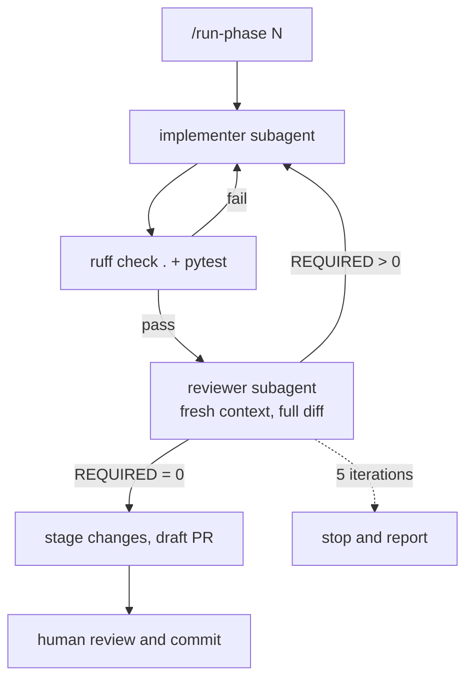

# lifespan-extract

Structured extraction of lifespan-intervention experiments from the longevity
literature, with a measured evaluation harness.

## What this is

Thousands of intervention experiments — this drug, this dose, this organism,
this effect on lifespan — exist only as prose inside PDFs. The manually curated
databases that collect them, DrugAge and GenAge, lag the published literature by
years because a human has to read each paper and type the numbers in. This
project ingests papers, extracts structured experiment records with an LLM, and
measures how accurately it does so against a gold set labeled by hand.

The measurement is the point. An extraction pipeline that cannot say how often
it is wrong is not usable for anything that matters, so the gold set and the
eval harness come before the pipeline rather than after it.

**MVP scope.** Organisms: *C. elegans*, *M. musculus*, and *M. mulatta* (rhesus
macaque). Sources: PubMed abstracts, PMC open-access full text, and bioRxiv
preprints. No fine-tuning — prompt, schema, and evals only.

## Status

Phase 0 (foundation and gold set) and Phase 1 (ingestion) are complete. Phase 2
(classification and extraction) is next. Every number below is counted from the
repository, not carried forward from an earlier draft of this file.

| | |
|---|---|
| Gold papers | 10 (9 PubMed, 1 bioRxiv preprint) |
| Experiment records across them | 26 |
| Source quotes | 221 (96 abstract, 125 full text) |
| Quotes verified character-exact | 214 |
| Quotes unverifiable | 7 (one paper is not in PMC open access) |
| Classifier negative set | 15 papers across 5 categories |
| Schema version | 0.4.0 |
| Tests | 485 |

The gold set covers hard cases deliberately: two consistency pairs on the same
intervention, a pair that disagrees on the direction of the effect, a
multi-organism paper, sex-specific effects split into separate records, and a
preprint with no PMID. Across 26 records the direction field is 18 `increase`,
7 `no_effect`, 1 `decrease`.

## Verification layer

`scripts/check_gold.py` verifies that every `source_quote` in the gold set
appears character-for-character in the text it claims to come from. Quotes
marked `abstract` are checked against the PubMed abstract, or against the
bioRxiv API for a preprint; quotes marked `full_text` are checked against PMC
open-access full text, resolved PMID to PMCID. Whitespace is collapsed on both
sides before comparison, because PMC's XML wraps lines where the published PDF
does not. Nothing else is normalized — case, punctuation, and the publisher's
typography are compared as they are.

A quote that cannot be checked, because the paper is not in PMC open access, is
reported as unverifiable rather than as passing or failing. A quote nobody can
verify is not a quote known to be wrong, and it is not a quote known to be right
either.

Two operations write into `data/gold/`: `--promote`, which moves a finished
draft in, and `--refresh-quotes --write`, which corrects a mistranscribed quote
string to the exact slice of source text it should have been. Both are
human-only. A `PreToolUse` hook enforces this at the filesystem level: it
distinguishes reads from writes for `data/gold/` and `.claude/`, allows the
reads, blocks the writes, and blocks any agent invocation of either flag.

The reason is not tidiness. The gold set is the standard Phase 3 measures
extraction against. If an agent can edit it, then a disagreement between the
pipeline and the gold set can be resolved by changing the gold set, and the eval
stops measuring extraction accuracy and starts measuring how readily the
standard bends. Phase 3 would be measuring Claude against Claude. The hook makes
that failure impossible rather than merely discouraged.

Two invariants hold across every record:

- **A `source_quote` is a contiguous verbatim slice of the source.** No ellipsis
  joining separate sentences, no editorial parentheticals, no summary of a table
  row. A value read off a table quotes that table row as PMC renders it.
- **Absent data is `not_reported` or null, never inferred.** A field the paper
  does not state stays empty, including when the likely answer is obvious.

## How this was built

Autonomous implementation is only worth trusting if the review of it is
independent of it. So the loop separates the two roles: an implementer that
writes code, and a reviewer that runs in a fresh context, never sees the
implementer's reasoning, and is given only the complete diff. A reviewer that
inherits the argument for a change tends to inherit its blind spots, and a
review that can be persuaded is not a check. `/run-phase N`, defined in
`.claude/`, is the implementation of that decision.

`/run-phase N` orchestrates one phase of PLAN.md. The orchestrator writes no
feature code. It dispatches an implementer subagent, runs `ruff` and `pytest`
itself, then dispatches a reviewer subagent in a fresh context with the complete
diff — never a summary of it. The reviewer did not write the code and reviews
against a seven-point checklist whose first three items are contract violations,
forbidden writes to `data/gold/`, and silent fallbacks. The loop repeats until
the reviewer returns zero REQUIRED items, capped at five iterations; on hitting
the cap it stops and reports rather than continuing.



Each iteration appends one line to `LOOP_LOG.md` recording the REQUIRED count
and what changed, which becomes the PR's audit trail.

Three things are reserved to the human and cannot be reached from inside the
loop:

1. **Gold-set labeling.** Every value in `data/gold/` is a human decision. An
   agent may scaffold a draft from paper metadata and act as scribe for values
   the human dictates, but never chooses one.
2. **Eval design.** Set composition, the headline metric, and what counts as
   agreement are signed off by the human before any number is produced.
3. **PR review between phases.** One phase is one branch is one PR. Commits are
   written by the human.

Write protection is layered rather than singular, because each layer fails
differently:

| layer | catches |
|---|---|
| `PreToolUse` hook | Any write to `data/gold/` or `.claude/`, at the filesystem level, before it happens |
| Reviewer subagent, fresh context | Code paths that would write there, and contract violations the implementer did not notice |
| CI | Schema validity, classifier-set structure, lint, and tests on every push |

The hook is the only one of the three that cannot be talked out of its position.

## Schema gaps

Recorded in NOTES.md as they were found during labeling, each with the record
that exposed it. Four remain open as v0.5.0 candidates.

1. **Per-statistic direction** — `lifespan_effect` carries one `direction` for
   the whole claim, so a qualitative statement about one statistic alongside a
   number for another cannot be expressed. Found in Miller 2011.
2. **Survival at a timepoint** — no field holds a survival proportion at a
   reported age, which is not median, mean, or maximum lifespan. Found in
   Colman 2009.
3. **Multi-source provenance** — a value derived from two or more places in the
   source has nowhere to record that, because `source_quote` is single and
   contiguous by convention. Found in Strong 2016, where `sample_size` summed
   two table rows.
4. **Species below the organism enum** — closed in v0.4.0. `organism` is a
   closed enum sized for the MVP filters, so every organism outside it collapsed
   to `other` and two such records were indistinguishable. `experiments[].species`
   now carries the actual species as free text. Found in Eisenberg 2009, whose
   yeast and fly records differed in no validated field.
5. **Unqualified percentage** — a lifespan percentage stated without naming
   median, mean, or maximum has no field, because every numeric field names a
   statistic and this project does not substitute one for another. Found in
   Calubag 2025.

Gaps 1 and 5 point the same direction: both want the statistic to be a *value*
carried alongside the number, rather than encoded in the field name. Designing
either alone would mean running the same migration twice.

## Limitations

**The gold set is small and single-labeler.** Ten papers, 26 records, labeled by
one person. A blind re-label of three randomly selected papers is scheduled for
2026-08-18 and has not been done, so **no self-agreement figure exists**. Until
it does, there is no evidence about how reproducible the labels are, including
by the same labeler.

**Three organisms, and the gold set is dominated by one.** Of 26 records, 19 are
*M. musculus*, 3 *C. elegans*, 2 *M. mulatta*, and 2 are `other` (one yeast, one
fly, from a multi-organism paper). Any per-organism figure outside mice will rest
on a handful of records.

**Labeling is abstract-first, so for some fields the standard itself is
abstract-limited.** Where a paper is not in PMC open access, or where a field is
stated only in the methods, the honest label is `not_reported` even though the
value appears in the paper. That is correct under the convention, and it means
the gold set systematically under-reports fields like `sex`, `dose`, and
`sample_size`.

The eval gives the model the same source the labeler used, decided per file from
that file's `extracted_from` values, so a model is never scored for extracting a
field the labeler could not see — see the *like-for-like source matching* entry
in NOTES.md. What remains is a ceiling rather than a penalty: on those fields,
per-field accuracy measures agreement with an abstract-limited standard rather
than with what the paper reports. A model that read the full text and got every
one of them right would score no higher, because the gold set does not record
them. The limit is the labeling convention, not the model.

**One direction is effectively untested.** The gold set holds a single `decrease`
record against 18 `increase`. Per-field accuracy on `decrease` will be
uninformative — a model that never predicts it loses almost nothing.

**Automated review shares the blind spots of the code it reviews.** The reviewer
subagent runs in a fresh context and never sees the implementer's reasoning,
which removes inherited assumptions but not the failure modes common to both. It
reliably catches contract violations, silent fallbacks and dishonest tests; it
does not catch domain-level implausibility, because nothing in the loop knows
biology. Human review between phases is not a formality in this project — it is
the only layer that checks whether the output is scientifically sensible.

**The classifier positives and the extraction ground truth are the same ten
papers.** Classifier precision and recall and per-field extraction accuracy are
therefore computed over a shared sample and are not independent evidence about
the pipeline.

**There is no held-out split, and prompts will be iterated against the set they
are scored on.** Every prompt revision is chosen partly by how it scores on the
gold set, so any figure this project eventually reports is optimistic by an
unknown amount. Closing this needs papers that have not been labeled here, which
is a Phase 3 scoping decision and not something the current set can fix.

## Repository layout

```
schema/             JSON Schema for experiment records (source of truth)
data/gold/          hand-labeled gold set — human-controlled
data/drafts/        in-progress labels, gitignored, promoted by hand
data/classifier_set/ hard negatives for the Phase 3 classifier eval
ingest/             PubMed E-utilities + bioRxiv clients, dedup by DOI
scripts/            gold-set tooling: scaffold, verify, validate, promote
.claude/            phase loop, subagent definitions, path-protection hook
NOTES.md            running design log: every schema change and why
PLAN.md             phase plan and working agreements
```

## Running the checks

```bash
.venv/bin/ruff check .
.venv/bin/pytest

# verify every gold quote against its source (network; --offline uses the cache)
.venv/bin/python scripts/check_gold.py --all

# schema validation and classifier-set structure, as CI runs them
.venv/bin/python scripts/validate_gold.py
.venv/bin/python scripts/validate_classifier_set.py
```
